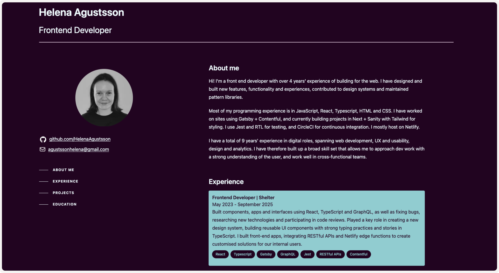

<p align="center">
    
</p>

# Helena Agustsson — Developer Portfolio

This is my personal developer portfolio, built in December 2025 to showcase my work and technical approach to modern web development.

🔗 **Live site:** https://helena-developer.vercel.app/

---

## About the project

This project is a **content-driven portfolio application** built with a decoupled architecture using Next.js and Sanity.

It was created to:

- Introduce myself and my work
- Showcase my frontend and full-stack development skills
- Demonstrate a scalable, CMS-driven approach
- Explore modern React patterns with TypeScript

---

## Tech stack

- **Framework:** Next.js
- **Language:** React & TypeScript
- **CMS:** Sanity (headless CMS)
- **Testing** Jest and RTL
- **Styling** Tailwind
- **Deployment:** Vercel

---

## Learning focus

My previous experience has primarily been with Gatsby and Contentful.  
I built this project in Next.js and Sanity to broaden my experience with a different framework and CMS ecosystem.

Given my background with static site generators and headless CMS integrations, I was able to apply existing knowledge of decoupled architecture while exploring new patterns and tooling.

---

### Next.js

I focused on understanding and applying:

- React Server and Client Components
- App Router and file-based routing
- Data fetching patterns
- Rendering strategies (SSG / SSR)

---

### Sanity

I used this project to gain hands-on experience with:

- GROQ queries for structured content retrieval
- Generating TypeScript types using Sanity Typegen
- Working with the Sanity Content Lake API

---

### Key takeaway

This project reinforced how transferable concepts such as component-based architecture, data modelling, and CMS integration are across different frameworks, while deepening my understanding of modern Next.js patterns.

---

## Deployment

The application is deployed on Vercel 🚀

🔗 **Live site:** https://helena-developer.vercel.app/

---

## Local development

Clone the repository and install dependencies:

```bash
git clone https://github.com/HelenaAgustsson/helena-developer
cd helena-developer
npm install
```

Run the development server:

```
npm run dev
```

Then open:

http://localhost:3000

---

## Architecture decisions

### 1. Decoupled architecture (Next.js + Sanity)

The frontend and content layer are separated using Sanity as a headless CMS.

**Why:**

- Content can be updated without redeploying the application
- Scales better than hardcoded data
- Mirrors real-world production architectures

---

### 2. Static generation where possible (SSG)

Pages are statically generated to optimise performance.

**Why:**

- Faster load times
- Improved SEO
- Reduced runtime complexity

---

### 3. Component-driven design

The UI is built using reusable React components (e.g. project listings, categories, images).

**Why:**

- Promotes consistency across the application
- Reduces duplication
- Makes future changes easier to implement

---

### 4. Type safety with TypeScript

TypeScript is used throughout, with types derived from CMS data where possible.

**Why:**

- Reduces runtime errors
- Improves developer experience
- Makes refactoring safer and more predictable

---

### 5. Content modelling in Sanity

Content is structured in Sanity schemas to support flexible and reusable data.

**Why:**

- Allows structured, queryable content
- Supports future expansion (e.g. adding new content types)
- Keeps frontend logic simpler

---

### 6. Deployment on Vercel

The application is deployed using :contentReference[oaicite:0]{index=0}.

**Why:**

- Seamless integration with Next.js
- Fast global CDN delivery
- Simple CI/CD workflow

---

### 7. Trade-offs and considerations

- Using a headless CMS adds complexity compared to static data, but improves scalability
- SSG improves performance but requires planning around content updates
- Type safety adds initial overhead but reduces long-term bugs

---
